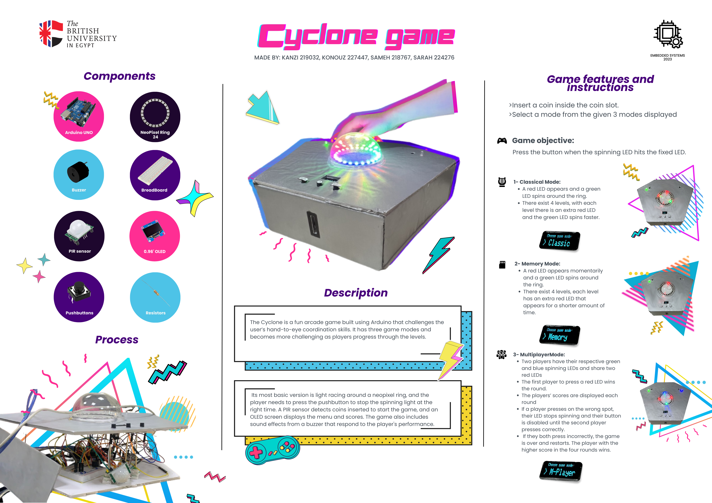
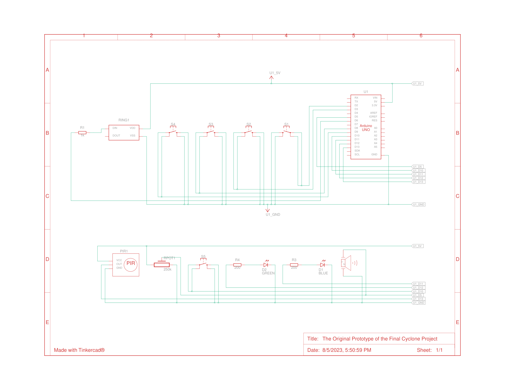

# Cyclone Game Project

#### Last Updated: August 5th, 2023

## Table of Contents

1. [Introduction](#introduction)
2. [Steps of Implementation](#steps-of-implementation)
3. [Gamemodes](#gamemodes)
   - [Classic Mode](#classic-mode)
   - [Memory Mode](#memory-mode)
   - [Multiplayer Mode](#multiplayer-mode)
4. [Schematics](#schematics)
5. [Tinkercad Simulation](#tinkercad-simulation)
6. [Components List](#components-list)
7. [Challenges](#challenges)
8. [Acknowledgements](#acknowledgements)

## Introduction 

The Cyclone Game is a captivating Arduino-based arcade experience that takes the classic cyclone game to new heights making it stand out from the traditional cyclone game as it is designed to test the player's hand-to-eye coordination skills. It features three exciting game modes: Classical, Multiplayer, and Memory. Each mode offers unique gameplay and progressively increases in difficulty as the player advances through the levels.

## Steps of Implementation 

The software setup is rather straight forward, just download [Arduino IDE](https://www.arduino.cc/en/software) if you haven't already, and you can the run the code with ease.
As for the hardware, you'll find below the [Tinkercad Simulation](#tinkercad-simulation) of the original prototype of the project. Feel free to copy it and modify it as you see fit.

Follow these steps to bring the Cyclone Game to life:

1. Start brainstorming and outline the logic for the game.
2. Code and simulate the game using Tinkercad, including all three modes, coin detection, buzzer sound effects, and OLED functionality (simulated and coded separately on Wokwi).
3. Procure all the required components for the physical implementation.
4. Connect all hardware components to the Arduino board according to the schematic.
5. Test the game by uploading the sketch to the Arduino board and playing it.
6. Create a visually appealing enclosure for the game and place the circuit inside for a complete setup.
   
## Gamemodes 

The Cyclone Game stood out from the traditional cyclone game due to the incorporation of new and diverse game modes. While the classic cyclone game typically offers a single gameplay experience, we took it to the next level by introducing three unique game modes to challenge the player's agility, memory and reaction time:

### Classic Mode 

- A green LED spins around the Neopixel ring while a stable red LED remains fixed.
- Press the button when the green LED aligns with the red LED.
- Successfully pressing at the right time advances you to the next level with an additional red LED and increased spinning speed.
- Reach higher levels by mastering your timing and precision.

### Memory Mode 

- Similar to Classical Mode, a green LED spins around the ring with a stable red LED.
- The red LED turns on for a specific time and then turns off.
- Remember the position of the red LED and press the button when the green LED lands on the recalled position.
- Progress through levels with more red LEDs and faster turn-offs, testing your memory and reflexes.

### Multiplayer Mode 

- Compete against a friend in this exciting two-player mode.
- Each player controls a green and blue spinning LED and shares two red LEDs.
- The first player to press a red LED wins the round and gains a point.
- The scores are displayed after each round.
- If a player presses incorrectly, their LED stops spinning, and their button is disabled until the other player makes a correct press.
- The player with the higher score after four rounds wins the game.

## Schematics 

## Tinkercad Simulation 

Experience the Cyclone Game in action by checking out the Tinkercad simulation:

[Tinkercad Simulation](https://www.tinkercad.com/things/fUFN8XD52Gq-the-original-prototype-of-the-final-cyclone-project/editel?sharecode=EPGT9eU04s1QHD5rv8lEthDOilY7PiGiQNwIQeM4Eas)

## Components List 

To build the Cyclone Game, you will need the following components:

- Two Arduino boards UNO
- Breadboard
- Buzzer
- OLED screen
- Pushbuttons
- PIR sensor
- NeoPixel Ring 24
- Resistors

## Challenges 

To say the undertaking of this project was difficult would be an understatement. The module's project description brought about various requirements that, within the constraints of time, led to many challenging decisions being made to satisfy those requirements. While this project was undoubtedly demanding, the journey was filled with valuable experiences that I am grateful for. In a perfect world, this is how I would've done things differently:

- **Use Arduino Mega 2560**: Using two Arduino Uno boards and establishing communication between them made the project far more difficult than it should've due to hardware limitations like signal speed, which often caused latency issues and, at times, defeated the whole purpose of the game which was all about pressing buttons fast.
- **3D Print the Structure**: The price may vary according to your location and design of choice, but it's well worth it as using cardboard was too flimsy for a game that requires aggressive button pressing as you progress with each level.
- **Optimize the Code**: The code was written in an unoptimized way because loops, in general, kept crashing the Arduino IDE or simply cause the code to not run properly. Unfortunately, I didn't have time to investigate the reasons, but maybe you do.
- **Rigorous Testing**: One thing I didn't account for, as someone in the field of software engineering, is the hardware limitations. While the code ran perfectly in simulation, issues started piling up once uploaded to the hardware. Button debouncing, broken components, and faulty wires wasted precious time and resources and completely changed how we worked on the software side of things.

## Acknowledgements 

This was first and foremost a group project with my three other team members: Sarah Abdelwareth, Konouz Abdelaziz and Kenzy Haitham. Special thanks to our TA for his supportive role throughout the journey and providing us with constant feedback on each phase of the project from start to finish.

